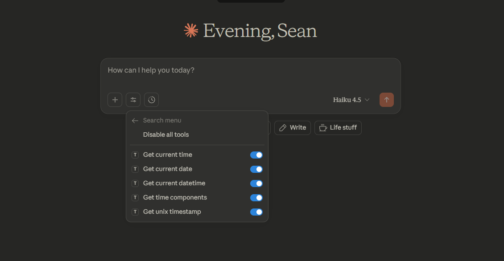

# Time MCP



A simple and lightweight Model Context Protocol (MCP) server that provides tools to fetch the current date and time from your system. Perfect for integrating time-related functionality into Claude, Gemini CLI, and other MCP-compatible LLM applications.

This MCP demonstrates core MCP functionality with a focused, practical use case that works reliably across all MCP-compatible platforms.

## Features

This MCP provides the following tools:

- **get_current_time()** - Returns the current time in HH:MM:SS format
- **get_current_date()** - Returns the current date in YYYY-MM-DD format
- **get_current_datetime()** - Returns both date and time in ISO 8601 format
- **get_time_components()** - Returns detailed breakdown of time (year, month, day, hour, minute, second, day of week)
- **get_unix_timestamp()** - Returns the current Unix timestamp

## Installation

### Prerequisites
- Python 3.9 or higher
- pip

### From PyPI (Recommended)

Once published, you can install directly from PyPI:

```bash
pip install time-mcp
```

### From Source (Development)

1. Clone the repository:
```bash
git clone https://github.com/DochertyDev/time-mcp.git
cd time-mcp
```

2. Install in development mode:
```bash
pip install -e .
```

3. Or install dependencies manually:
```bash
pip install -r requirements.txt
```

## Running the Server

To start the MCP server:

```bash
python src/server.py
```

The server will start and wait for incoming MCP protocol connections.

## Testing with MCP Inspector

To debug and test your MCP with the MCP Inspector:

```bash
mcp dev src/server.py
```

This will open the MCP Inspector interface where you can test each tool interactively.

## Using with Claude Desktop

To add this MCP to Claude Desktop, update your `claude_desktop_config.json`:

### If installed from PyPI:
```json
{
  "mcpServers": {
    "time-mcp": {
      "command": "time-mcp"
    }
  }
}
```

### If installed from source:
```json
{
  "mcpServers": {
    "time-mcp": {
      "command": "python",
      "args": ["C:\\path\\to\\time-mcp\\src\\server.py"]
    }
  }
}
```

Replace `C:\\path\\to\\time-mcp` with the actual path to your time-mcp directory.

## Using with Gemini CLI

Add to your Gemini CLI settings.json:

```json
{
  "mcpServers": {
    "time-mcp": {
      "command": "time-mcp"
    }
  }
}
```

## Project Structure

```
time-mcp/
├── src/
│   └── server.py           # Main MCP server implementation
├── tests/                  # Test files
├── examples/               # Example usage scripts
├── README.md               # This file
├── pyproject.toml          # Project configuration
└── requirements.txt        # Python dependencies
```

## Code Structure

The server is implemented using the FastMCP framework, which simplifies MCP development:

```python
from mcp.server.fastmcp import FastMCP

mcp = FastMCP("time-mcp")

@mcp.tool()
def get_current_time() -> str:
    """Get the current time from the system."""
    # Implementation here
    return result

if __name__ == "__main__":
    mcp.run()
```

## Security Notes

- This MCP only accesses time-related information from your system
- No file system access
- No network requests
- No external API calls
- No credentials or secrets required

## Development

To run tests:

```bash
pytest tests/
```

To format code:

```bash
black src/
```

## Troubleshooting

**Issue:** MCP Inspector won't connect
- Solution: Ensure Python 3.9+ is installed and the mcp package is available

**Issue:** Tools not appearing in Claude
- Solution: Make sure the MCP server is running and properly configured in claude_desktop_config.json

**Issue:** Import errors
- Solution: Run `pip install -r requirements.txt` to ensure all dependencies are installed

## License

MIT License - Feel free to use and modify as needed.

## Contributing

Contributions are welcome! Please feel free to submit a Pull Request.

## Support

If you encounter any issues, please open an issue on [GitHub](https://github.com/DochertyDev/time-mcp/issues).

## Next Steps

After using this MCP, consider:
- Exploring other MCPs in the [Awesome MCP Servers](https://github.com/modelcontextprotocol/awesome-mcp-servers) repository
- Building your own MCP using the [MCP Python SDK](https://github.com/modelcontextprotocol/python-sdk)
- Contributing improvements or extensions to this project
